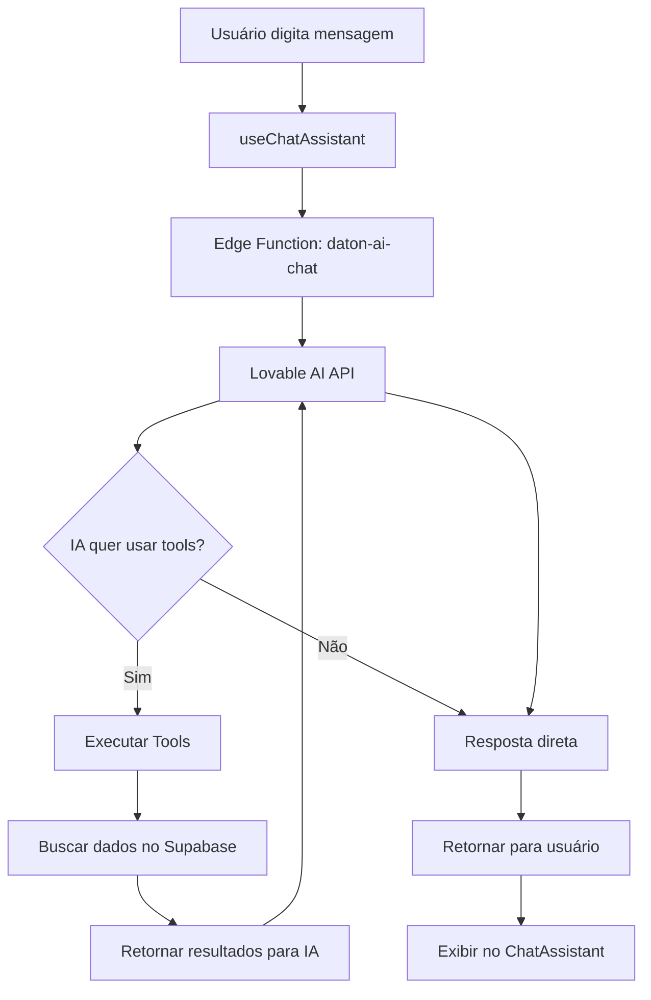

# Sistema de IA Daton - Documentação Completa

## Visão Geral

O Daton possui um sistema de IA robusto e completo que ajuda os usuários em todas as áreas da gestão ESG, utilizando dados reais da empresa através de tool calling inteligente.

## Arquitetura

### 1. Edge Function: daton-ai-chat
**Localização:** `supabase/functions/daton-ai-chat/index.ts`

Esta função é o coração do sistema de IA, responsável por:
- Processar mensagens dos usuários
- Chamar a API Lovable AI (Google Gemini 2.5 Flash)
- Executar tool calling para acessar dados reais
- Retornar respostas contextualizadas

#### Ferramentas Disponíveis (Tools)

1. **get_emissions_data**
   - Busca dados de emissões de GEE
   - Filtra por escopo (1, 2, 3 ou todos)
   - Retorna totais, fontes e análise

2. **get_licenses_status**
   - Verifica status de licenças ambientais
   - Identifica vencimentos próximos
   - Classifica por urgência

3. **get_goals_progress**
   - Acompanha progresso de metas ESG
   - Filtra por categoria (ambiental, social, governança)
   - Calcula médias e status

4. **get_compliance_status**
   - Avalia conformidade regulatória geral
   - Calcula score de compliance
   - Identifica riscos

5. **get_waste_metrics**
   - Analisa gestão de resíduos
   - Classifica por tipo
   - Rastreia destinação

6. **get_employee_metrics**
   - Métricas de colaboradores
   - Distribuição por departamento
   - Indicadores sociais

### 2. Hook: useChatAssistant
**Localização:** `src/hooks/useChatAssistant.tsx`

Hook React que gerencia:
- Estado das mensagens
- Envio de mensagens para o edge function
- Loading states
- Contexto da página atual
- Tratamento de erros

**Uso:**
```typescript
const { messages, isLoading, sendMessage, clearMessages } = useChatAssistant();

// Enviar mensagem
await sendMessage('Como estão as emissões?', 'inventario-gee');

// Limpar chat
clearMessages();
```

### 3. Componente: ChatAssistant
**Localização:** `src/components/ChatAssistant.tsx`

Componente de UI que fornece:
- Interface de chat flutuante
- Minimização/maximização
- Scroll automático
- Formatação de markdown
- Ações sugeridas
- Contexto visual de dados acessados

## Integração

### Como Adicionar o Chat em uma Página

```typescript
import { ChatAssistant } from '@/components/ChatAssistant';

export function MinhaPage() {
  return (
    <div>
      {/* Seu conteúdo */}
      
      {/* Chat Assistant - aparece como botão flutuante */}
      <ChatAssistant />
    </div>
  );
}
```

### Contexto por Página

O sistema adapta suas respostas baseado na página atual:

- **dashboard**: Visão geral e KPIs
- **inventario-gee**: Foco em emissões e carbono
- **licenciamento**: Licenças e vencimentos
- **metas**: Progresso de OKRs e objetivos
- **gestao-esg**: Análise holística ESG
- **documentos**: Gestão documental
- **auditoria**: Conformidade e auditorias

## Fluxo de Funcionamento



## Exemplos de Uso

### 1. Análise de Emissões
**Usuário:** "Como estão nossas emissões este mês?"

**IA irá:**
1. Chamar `get_emissions_data` com scope='all'
2. Analisar dados reais de emissões
3. Fornecer totais por escopo
4. Identificar principais fontes
5. Comparar com histórico

### 2. Verificar Licenças
**Usuário:** "Alguma licença vencendo em breve?"

**IA irá:**
1. Chamar `get_licenses_status` com urgency='expiring_soon'
2. Listar licenças próximas do vencimento
3. Calcular dias até vencimento
4. Sugerir ações de renovação

### 3. Status de Metas
**Usuário:** "Como está o progresso das metas ambientais?"

**IA irá:**
1. Chamar `get_goals_progress` com category='environmental'
2. Calcular progresso médio
3. Identificar metas em risco
4. Sugerir prioridades

## Boas Práticas

### Para Desenvolvedores

1. **Sempre passe o contexto da página:**
```typescript
sendMessage(userInput, getCurrentPage());
```

2. **Trate erros adequadamente:**
```typescript
try {
  await sendMessage(input, page);
} catch (error) {
  toast.error('Erro ao enviar mensagem');
}
```

3. **Use loading states:**
```typescript
{isLoading && <LoadingIndicator />}
```

### Para Usuários

1. **Seja específico nas perguntas:**
   - ✅ "Quais licenças vencem em 30 dias?"
   - ❌ "Licenças?"

2. **Use o contexto da página:**
   - Na página de emissões, pergunte sobre GEE
   - Na página de metas, pergunte sobre OKRs

3. **Aproveite as ações sugeridas:**
   - A IA sugere próximos passos
   - Clique para navegar diretamente

## Configuração

### Variáveis de Ambiente Necessárias

```bash
LOVABLE_API_KEY=<sua-chave>
SUPABASE_URL=<sua-url>
SUPABASE_SERVICE_ROLE_KEY=<sua-chave>
```

### Modelo de IA

Atualmente usando: **google/gemini-2.5-flash**
- Rápido e eficiente
- Ótimo custo-benefício
- Suporta tool calling
- Gratuito até 13/10/2025

## Manutenção

### Adicionar Nova Ferramenta (Tool)

1. **Definir no array tools:**
```typescript
{
  type: "function",
  function: {
    name: "nova_ferramenta",
    description: "O que esta ferramenta faz",
    parameters: {
      type: "object",
      properties: {
        // parâmetros
      }
    }
  }
}
```

2. **Implementar no executeTool:**
```typescript
case 'nova_ferramenta': {
  const { param } = args;
  // Buscar dados
  return { dados };
}
```

### Melhorar Prompts

Edite a função `getPageContext()` e o `systemPrompt` em:
`supabase/functions/daton-ai-chat/index.ts`

## Monitoramento

### Logs Importantes

1. **Edge Function Logs:**
   - Verificar tool calls executados
   - Erros de API
   - Tempo de resposta

2. **Client Logs:**
   - Mensagens enviadas/recebidas
   - Erros de conexão
   - Estado do chat

### Métricas de Performance

- Tempo médio de resposta: < 3s
- Taxa de sucesso: > 95%
- Uso de tokens: ~500-1000 por resposta

## Roadmap Futuro

### Curto Prazo
- [ ] Histórico de conversas persistente
- [ ] Sugestões proativas baseadas em dados
- [ ] Integração com notificações

### Médio Prazo
- [ ] Voice input/output
- [ ] Análises preditivas
- [ ] Relatórios automatizados

### Longo Prazo
- [ ] Multi-idioma
- [ ] Fine-tuning com dados específicos
- [ ] Integração com outros sistemas

## Suporte

Para questões técnicas ou sugestões:
- Documentação: Este arquivo
- Logs: Supabase Edge Function Logs
- Código: `supabase/functions/daton-ai-chat/`

## Conclusão

O Sistema de IA do Daton é robusto, inteligente e totalmente integrado com dados reais. Ele utiliza as melhores práticas de AI engineering, incluindo tool calling, context awareness, e error handling, para fornecer uma experiência excepcional aos usuários.
